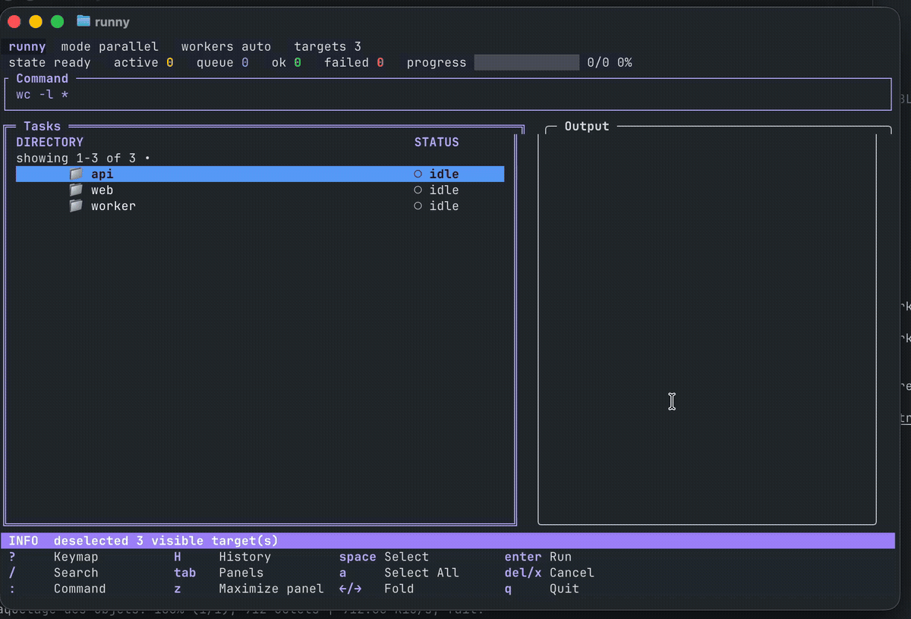

<div align="center">

# Runny

Run one shell command across selected child directories from a terminal UI.

[](https://github.com/theopoc/runny)
[](https://github.com/theopoc/runny/releases)
[](https://go.dev/doc/)
[](LICENSE)

</div>

## Overview

`Runny` discovers child directories, lets you select targets in a terminal UI, and runs the same command across them. It supports parallel or serial execution, filtering, cancellation, run history, and optional persisted logs.

Runny is 100% vibe coded.



## Features

- Select and filter directories before running a command.
- Run targets in parallel with a worker limit, or one at a time.
- Cancel queued or active runs and rerun failures.
- Review live output and command history in the TUI.
- Configure discovery, execution, and logging through YAML files or CLI flags.

By default, `Runny` discovers directories up to depth 3, excludes hidden directories, skips symlinked directories, and runs in parallel.

## Installation

Install with Homebrew:

```bash
brew install --cask theopoc/tap/runny
```

If your Homebrew setup requires trusted taps:

```bash
brew tap theopoc/tap
brew trust --tap theopoc/tap
brew install --cask runny
```

## Quick Start

Launch the TUI, optionally with an initial command and execution settings:

```bash
runny
runny -- pnpm test
runny --depth 2 --workers 4 -- pnpm test
runny -- printf '%s\n' 'hello world'
runny -- sh -c 'pnpm test && pnpm lint'
```

`Runny` always opens the TUI. Flags and config files prepare the initial discovery, command, execution mode, and logging options.

Arguments after `--` keep their original boundaries. Shell metacharacters inside an argument are treated as data. Use `sh -c` explicitly when the command needs shell composition such as `&&`, pipes, or redirections.

## Docker

Build the image:

```bash
docker build -t runny .
```

Run the TUI in a container:

```bash
docker run --rm -it -v "$PWD:/workspace" -w /workspace runny
docker run --rm -it -v "$PWD:/workspace" -w /workspace runny --depth 2 -- pnpm test
```

The TUI forces a truecolor render profile, so Docker runs do not need extra terminal color environment flags. Commands run inside the container; tools installed only on the host, such as `pnpm` or project-specific CLIs, must also exist in the image or be provided by a custom image.

## Flags

| Flag | Short | Description |
| --- | --- | --- |
| `--config FILE` | `-c` | Explicit config file |
| `--recursive` | `-r` | Discover recursively |
| `--depth N` | `-d` | Discovery depth, default `3`, `1` direct children, `0` unlimited |
| `--include-hidden` | `-H` | Include hidden directories |
| `--include PATTERN` | `-i` | Include matching directories, repeatable |
| `--exclude PATTERN` | `-e` | Exclude matching directories, repeatable |
| `--serial` | `-s` | Run one target at a time |
| `--workers N` | `-w` | Max parallel target runs |
| `--fail-fast` | `-f` | Cancel queued work after first failure |
| `--save-logs` | `-L` | Persist logs under `.runny/runs/` |
| `--disable-logging` | `-N` | Disable log capture |
| `--version` | `-v` | Print version |

`--include` and `--exclude` are mutually exclusive. `--serial` and `--workers` are mutually exclusive. `--disable-logging` and `--save-logs` are mutually exclusive.

## Configuration

Configuration loads in this order, with later sources taking precedence:

1. `~/.runny.yaml`
2. `./.runny.yaml`
3. `--config FILE`
4. CLI flags

Example:

```yaml
recursive: true
depth: 2
include_hidden: false
workers: 4
fail_fast: false
save_logs: false
disable_logging: false
exclude:
  - node_modules
```

## Shortcuts

| Key | Action |
| --- | --- |
| `space` | Select/deselect focused directory |
| `a` | Select all visible directories |
| `A` | Deselect all visible directories |
| `/` | Focus filter/search |
| `:` | Open command overlay |
| `o` | Open session options; `left`/`right` changes category, `up`/`down` selects, `space`/`enter` toggles, `esc` closes |
| `ctrl+p` | Open command palette |
| `enter` | Run or confirm |
| `tab` | Change focus |
| `up`, `k` | Move cursor up |
| `down`, `j` | Move cursor down |
| `g` | Move to first visible directory |
| `G` | Move to last visible directory |
| `right`, `l` | Unfold focused directory |
| `left`, `h` | Fold focused directory |
| `esc` | Leave filter focus |
| `H` | Show command/run history |
| `?` | Show shortcuts |
| `del`, `x` | Cancel selected running or queued runs, or focused run; multiple selected active runs require confirmation |
| `q` | Confirm quit with Yes/No |
| `R` | Rerun all failed with confirmation |
| `pageup`, `pagedown` | Scroll output |
| Mouse wheel | Move one task when Tasks is focused; scroll three lines when Output is focused |
| `f` | Toggle output tail mode |
| `ctrl+c` | Confirm quit with Yes/No; `tab` switches choice, Yes cancels active runs cleanly |

Palette commands include `run`, `options`, `workers N|auto`, `serial`, `parallel`, `failed`, `rerun-failed`, `cancel`, `cancel-all`, `logs`, `history`, and `clear-filter`.

Session options include serial execution, fail-fast behavior, output capture, persisted logs, output following, and pane maximization. Execution and logging options stay locked while runs are active; view options remain mutable. Changes apply to current session and do not rewrite configuration files.

## Development

Run the checks used for local development:

```bash
go test ./...
go build ./cmd/runny
```

## Contributing

Open an [issue](https://github.com/theopoc/runny/issues) for bugs or proposed changes. Pull requests are welcome at [theopoc/runny](https://github.com/theopoc/runny/pulls).

Before submitting a pull request, run:

```bash
go test ./...
go build ./cmd/runny
```

## License

Licensed under the [MIT License](LICENSE).
